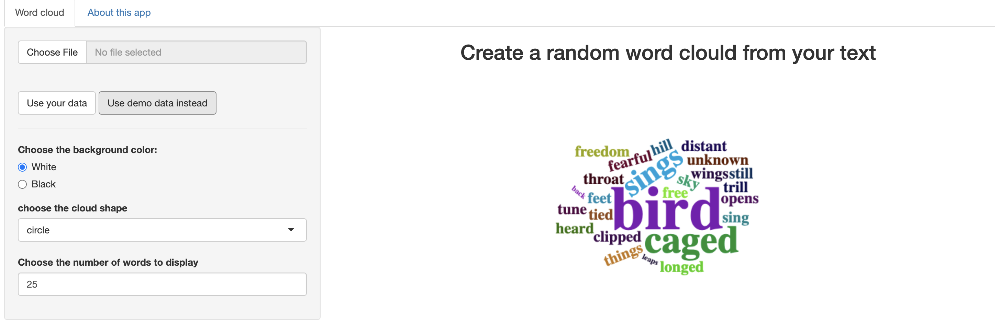

# wordcloud_shinyApp

This is a shiny app that creates a wordcloud (logo) of your text of choice.

## Installation

The following packages are required:
* "shiny"
* "wordcloud2"
* "tools"
* "tm"

Can be installed like this: install.packages(c("shiny", "wordcloud2", "tm"))

## Running
To run the app type:
shiny::runGitHub("dfimerel/wordcloud_shinyApp")

